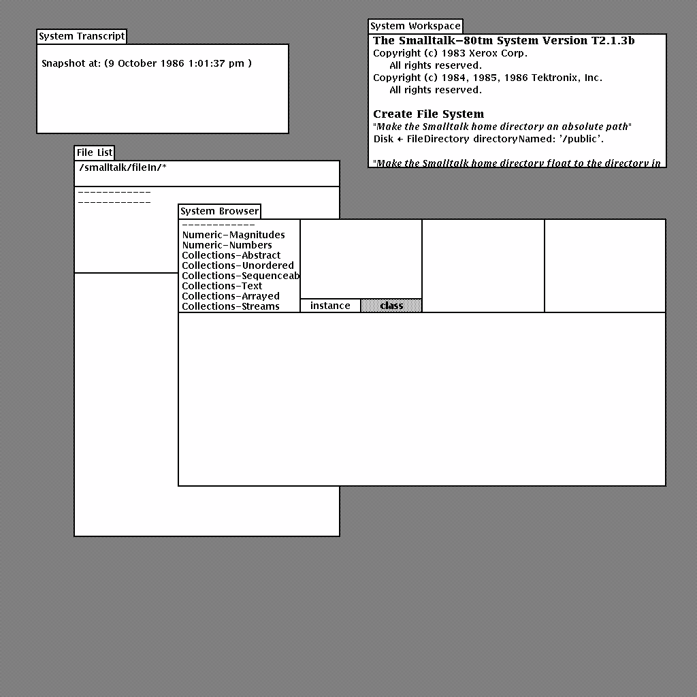
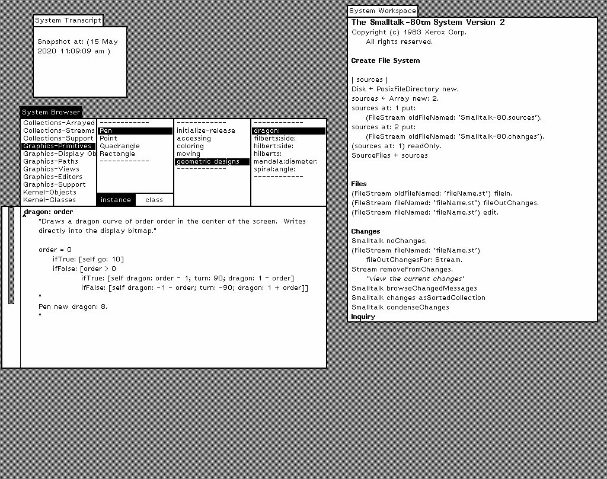

# Tektronix 4404 Smalltalk-80

A "by the Blue Book" C++ implementation of the Smalltalk-80 virtual machine that
boots two historical virtual images to a fully interactive desktop:

- **Tektronix 4404** `standardImage` — Smalltalk-80 T2.1.3b (68000, big-endian).
  **This is the default image.**
- **Xerox** `snapshot.im` — the Blue Book Smalltalk-80 System Version 2
  (little-endian).

The interpreter, object memory, and BitBlt are based on Dan Banay's Smalltalk-80
implementation. This repository adds support for the Tektronix image format, a
[Bazel](https://bazel.build/) build with an SDL2 front end, and a working
mouse/keyboard input path for both images.

| Tektronix 4404 (default) | Xerox |
|---|---|
|  |  |

*Both screenshots are captured from this VM booting the shipped images.*

## Requirements

- [Bazel](https://bazel.build/) (or Bazelisk)
- SDL2 development libraries

```sh
# Debian/Ubuntu
sudo apt-get install libsdl2-dev
```

## Building

```sh
bazel build //:smalltalk_tek
```

A traditional `make` build is also available under `linux/` (see
[Other build systems](#other-build-systems)).

## Running

Run the binary **from the repository root** so it can find the virtual images
and the Smalltalk source/changes files.

```sh
# Tektronix 4404 image (default)
./bazel-bin/smalltalk_tek

# Xerox image
./bazel-bin/smalltalk_tek -xerox
```

> **Note:** the Tektronix image boots noticeably slower than the Xerox image —
> allow up to a minute to reach the desktop.

The virtual images ship with the repository:

| Image | Path |
|---|---|
| Tektronix 4404 (default) | `tektronix/standardImage` |
| Xerox | `files/snapshot.im` |

### Command-line options

| Option | Description |
|---|---|
| `-tek`, `--tektronix` | Boot the Tektronix 4404 image (default). |
| `-xerox`, `--xerox` | Boot the Xerox release image. |
| `-image <path>` | Load a snapshot from an explicit path. |
| `-three` | Use the three-button mouse mapping (see below). |
| `-screenshot <file>` | Periodically write a BMP screenshot to `<file>`. |
| `-exit-after <ms>` | Exit after `<ms>` milliseconds (useful for automation). |
| `-h`, `--help` | Show usage. |

## Using the mouse

Smalltalk-80 expects a three-button mouse: **Red** (select), **Yellow**
(menus / *do it*), and **Blue** (window operations such as close). By default a
two-button mouse is assumed:

| Mouse action | Smalltalk button |
|---|---|
| Left button | Red (select) |
| Right button | Yellow (menu / *do it*) |
| Ctrl + Left | Yellow (menu / *do it*) |
| Alt + Left | Blue (window operations) |

Pass `-three` for the native three-button mapping (Left = Red, Middle = Yellow,
Right = Blue).

Clicking the **Yellow** button over the desktop background raises the Smalltalk
system menu.

## Keyboard

Printable characters are sent as typed. Following Smalltalk-80 conventions,
assignment (`←`) is `Shift`-`-` and the up-arrow (`↑`) is `Shift`-`6`.

## How it works

The VM loads a virtual image (a snapshot of the Smalltalk object memory), then
resumes the suspended process and interprets bytecodes, rendering the display
bitmap to an SDL2 window and feeding mouse/keyboard events back into the image.

The two images differ in several low-level details that the loader and
interpreter handle per image type:

- **Object table layout** — the Xerox object table lives at the tail of the file
  (little-endian); the Tektronix table is stored after the object data
  (big-endian).
- **Byte order** — Tektronix words are big-endian and store byte 0 in the high
  half of a word; Xerox words are little-endian with byte 0 in the low half.
- **Known-object oops** — the special `nil`/`true`/`false`/scheduler pointers and
  the `SmallInteger` / `CompiledMethod` class oops used by method dispatch and
  garbage collection are set for each image.

## Other build systems

The `linux/` directory contains a `make`-based build that produces the same VM:

```sh
cd linux && make
cd ..
./linux/Smalltalk            # Tektronix 4404 (default)
./linux/Smalltalk -xerox     # Xerox
```

The `osx/`, `windows/`, and `bsd/` directories contain the original per-platform
projects from the upstream implementation; the SDL2 front end (`main_sdl.cpp`)
and Bazel build are the supported path for booting both images.

## Credits

The core interpreter, object memory, and BitBlt are based on Dan Banay's
Smalltalk-80 implementation (MIT License). The Xerox virtual image originates
from Mario Wolczko's Smalltalk-80 archive; the Tektronix 4404 `standardImage` is
the Tektronix Smalltalk-80 T2.1.3b release.

## License

MIT — see [LICENSE](LICENSE).
